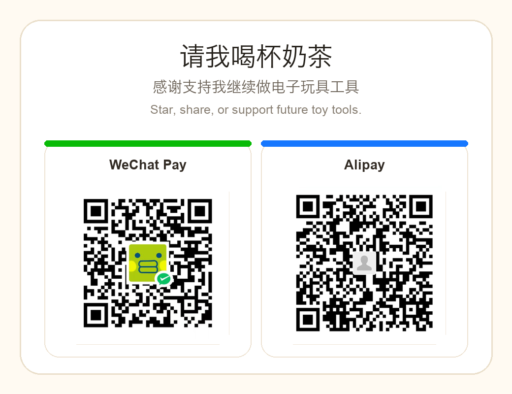

# Hi, I'm Xiyu / 惜羽

I build tools for electronic toys, retro handhelds, game workflows, and hardware-assisted automation.

我正在做电子玩具、掌机、单片机自动化和复古游戏相关的开源工具。  
我的兴趣是把玩家社区里的真实需求，做成普通人也能使用的工具。

---

## What I Do

- Electronic toy tools / 电子玩具工具
- Nintendo Switch and retro game workflows
- ESP32 / MCU-based automation
- Pixel-art and image-to-action pipelines
- Frontend, desktop apps, and product prototyping
- AI-assisted indie software development

---

## Featured Project

### Friend Maker / 朋友制作器

A macOS / Windows toolkit that converts images into pixel grids and ESP32 controller scripts for automatic drawing on Nintendo Switch.

一个面向 Nintendo Switch《朋友收集：梦想生活》的自动绘制工具。

- 700+ GitHub stars
- ESP32 firmware + desktop app + image-to-script workflow
- Supports image import, pixel preview, script generation, firmware flashing, controller testing, and timing tuning
- Built for real hardware workflows, not just a demo

Repo: [friendmaker](https://github.com/zhouxiyu1997/friendmaker)

---

## Other Projects

### Tamagotchi Smart DIM Flasher

A local macOS + CH341A web flasher for backing up, writing, restoring, and resetting Tamagotchi Smart cards.

Repo: [tamagotchi-smart-dim-flasher](https://github.com/zhouxiyu1997/tamagotchi-smart-dim-flasher)

### TamagotchiGO

Experiments around Tamagotchi GO and electronic toy hacking.

Repo: [TamagotchiGO](https://github.com/zhouxiyu1997/TamagotchiGO)

---

## Currently Exploring

- Open-source tools for Tamagotchi and electronic toys
- ESP32-based hardware automation
- Pixel-art workflows for games and handheld devices
- AI-assisted indie development
- Small tools that connect fandom, hardware, and creativity

---

## Tech Stack

TypeScript / React / Vue / Tailwind CSS / Node.js  
ESP32 / PlatformIO / Python / Web Serial / Desktop Apps  
GIS / Cesium / ECharts / Product Prototyping / 3D Printing

---

## Support / 支持我

If my projects helped you, the best support is to star the repo and share it with people who may need it.

如果这些项目帮到了你，最好的支持是点一个 Star，并分享给可能需要的人。

If you'd like to support my future work, you can also buy me a milk tea 🧋  
如果你愿意支持我继续做电子玩具和玩家工具，也可以请我喝一杯奶茶 🧋

---

## Find Me

For collaboration, freelance work, or job opportunities, feel free to email me.  
如果有合作、外包、兼职或工作机会，欢迎通过邮件联系我。

- GitHub: [@zhouxiyu1997](https://github.com/zhouxiyu1997)
- 小红书：惜羽拓麻镇
- Email: zhouxiyu1997@gmail.com

---

> I like building small, strange, useful tools for people who love electronic toys.
